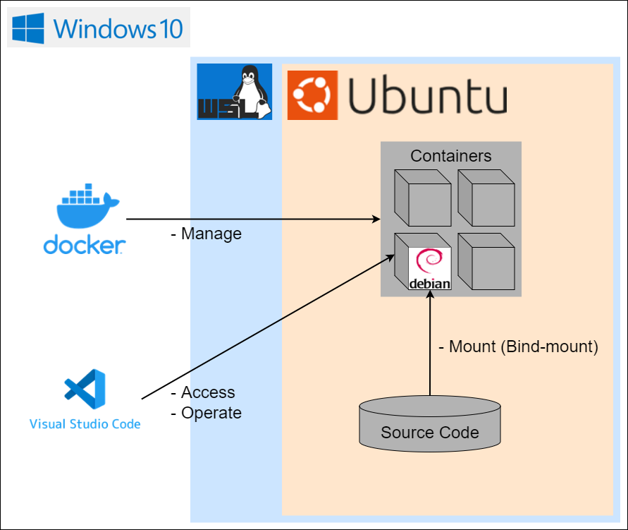
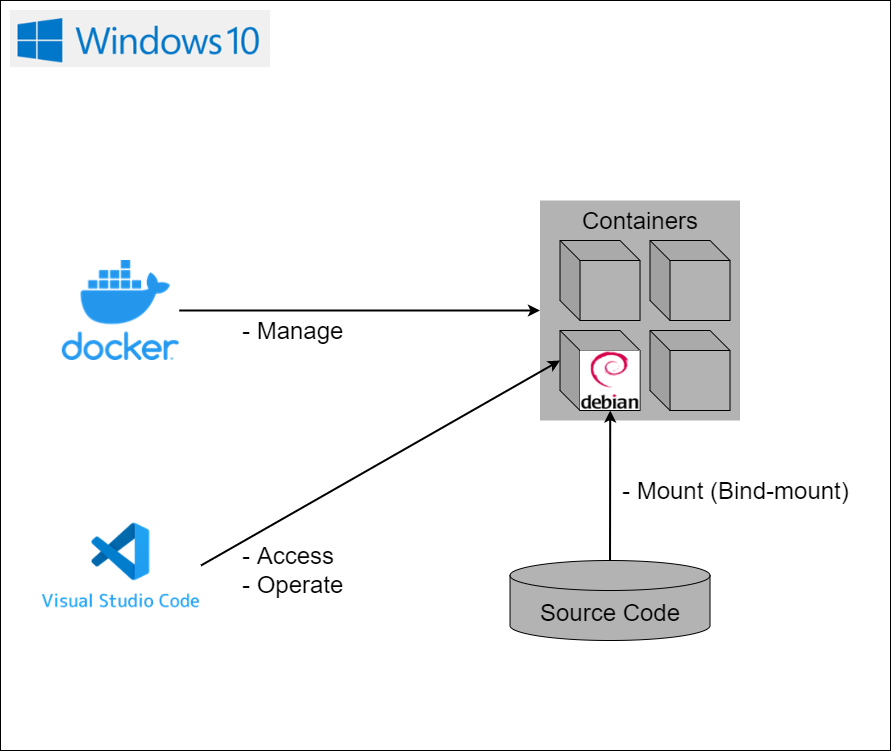

# dev-container-python <!-- omit in toc -->

- [1. 概要](#1-概要)
- [2. 構成図](#2-構成図)
  - [2.1. (補足事項) なぜWindows10から敢えてUbuntuを経由してContainersを起動する構成にしているのか](#21-補足事項-なぜwindows10から敢えてubuntuを経由してcontainersを起動する構成にしているのか)
    - [2.1.1. 参考サイト](#211-参考サイト)
- [3. 動作確認環境](#3-動作確認環境)
- [4. セットアップ方法](#4-セットアップ方法)
  - [4.1. VSCode (Visual Studio Code)](#41-vscode-visual-studio-code)
    - [4.1.1. 参考サイト](#411-参考サイト)
  - [4.2. WSL2 (Windows Subsystem for Linux 2)](#42-wsl2-windows-subsystem-for-linux-2)
    - [4.2.1. 参考サイト](#421-参考サイト)
  - [4.3. Ubuntu on WSL2](#43-ubuntu-on-wsl2)
    - [4.3.1. Ubuntuのインストール](#431-ubuntuのインストール)
      - [4.3.1.1. 参考サイト](#4311-参考サイト)
    - [4.3.2. VPN接続時のDNSサーバーの設定](#432-vpn接続時のdnsサーバーの設定)
      - [4.3.2.1. 参考サイト](#4321-参考サイト)
    - [4.3.3. Gitの初期設定](#433-gitの初期設定)
      - [4.3.3.1. 参考サイト](#4331-参考サイト)
    - [4.3.4. Gitリポジトリのクローン](#434-gitリポジトリのクローン)
    - [4.3.5. (推奨) WSL2のメモリサイズの設定](#435-推奨-wsl2のメモリサイズの設定)
      - [4.3.5.1. 参考サイト](#4351-参考サイト)
    - [4.3.6. (任意) 日本語化](#436-任意-日本語化)
      - [4.3.6.1. 参考サイト](#4361-参考サイト)
    - [4.3.7. (任意) エイリアス定義ファイルの作成](#437-任意-エイリアス定義ファイルの作成)
  - [4.4. Docker](#44-docker)
    - [4.4.1. 参考サイト](#441-参考サイト)
- [5. 起動方法](#5-起動方法)
  - [5.1. Docker](#51-docker)
  - [5.2. Ubuntu on WSL2](#52-ubuntu-on-wsl2)
  - [5.3. VSCode](#53-vscode)
- [6. トラブルシューティング](#6-トラブルシューティング)
  - [6.1. DockerDesktopの起動に失敗する](#61-dockerdesktopの起動に失敗する)
    - [6.1.1. 参考サイト](#611-参考サイト)
  - [6.2. DevContainerの起動に失敗する](#62-devcontainerの起動に失敗する)
    - [6.2.1. 参考サイト](#621-参考サイト)

## 1. 概要

`VSCode`の拡張機能`Dev Containers`、`Docker`、`WSL2`の併用で、ホスト環境を汚すことなくリモートに開発環境を構築できる。

また、`VSCode`の設定や拡張機能のインストールなどは`devcontainer.json`に、
開発言語ごとのイメージの管理やパッケージのインストールなどは`Dockerfile`に記述することができ、
開発環境をコードとして管理できる。

## 2. 構成図

下記図のように開発環境を構築すると、`VSCode`から拡張機能`Dev Containers`を用いて`Docker`のコンテナにアクセスし、
コンテナ内にあるファイルの編集を`VSCode`上で行える。
ソースコードに関しては、マウントすることによりコンテナ内で永続化できる。



### 2.1. (補足事項) なぜWindows10から敢えてUbuntuを経由してContainersを起動する構成にしているのか

<details>
<summary>
詳細
</summary>

まずはタイトルを言い換えると、なぜWindows10から直接Containersを起動する構成にしていないのか、とも言える。

この疑問に関しては、参考サイト2に記載されていた内容が理由になる。引用と和訳を以下に示す。

> Best practices
> 
> To get the best out of the file system performance when bind-mounting files,
> we recommend storing source code and other data that is bind-mounted into Linux containers in the Linux file system,
> rather than the Windows file system. You can also refer to the recommendation from Microsoft.

> 最善の方法
> 
> ファイルをバインドマウントする時、ファイルシステムの性能を最大限に活用するために、
> Linuxコンテナにバインドマウントされるソースコードや他のデータを、WindowsファイルシステムよりLinuxファイルシステムに格納することを推奨しています。
> マイクロソフトからの[おすすめ](https://learn.microsoft.com/ja-jp/windows/wsl/compare-versions)も参照してください。

つまり、データをバインドマウントする時、WindowsファイルシステムのデータをLinuxファイルシステムにマウントするのはかなり遅くなるため止めた方がよいとのこと。
マウントするのであれば、Linuxファイルシステムのデータを同じくLinuxファイルシステムにマウントした方がよいとのこと。

実際、あるリポジトリをビルドした際にはとても遅く感じた上に、コマンドの返却も10秒程度の遅延があった。
このことから、元々は下記構成図であったが上記構成図に変更した。


</details>

#### 2.1.1. 参考サイト

1. [WSL2 + VSCode DevContainerでFilesharingの警告 - Qiita](https://qiita.com/noonworks/items/5d49e019e794dbabe92a)
2. [Docker Desktop WSL 2 backend | Docker Documentation](https://docs.docker.com/desktop/windows/wsl/#best-practices)

## 3. 動作確認環境

- Windows 10 Pro 22H2
- VSCode 1.76.2
- Dev Containers v0.282.0
- Docker Desktop v4.12.0
- WSL2
- Ubuntu 22.04.1 LTS
  - CLI
- Debian 11
  - コードネーム：bullseye
  - CLI

システム要件は下記リンクを参照する。
- [Developing inside a Container using Visual Studio Code Remote Development](https://code.visualstudio.com/docs/remote/containers#_system-requirements)

## 4. セットアップ方法

上記の構成図通りに開発環境を構築する。

### 4.1. VSCode (Visual Studio Code)

1. `Windows 10`で下記リンクからWindows版の`VSCode`をダウンロードし、インストールする
    - [Download Visual Studio Code - Mac, Linux, Windows](https://code.visualstudio.com/download)
2. `Windows 10`で下記リンクから`VSCode`に拡張機能をインストールする
    - [Japanese Language Pack for Visual Studio Code - Visual Studio Marketplace](https://marketplace.visualstudio.com/items?itemName=MS-CEINTL.vscode-language-pack-ja)
    - [Dev Containers - Visual Studio Marketplace](https://marketplace.visualstudio.com/items?itemName=ms-vscode-remote.remote-containers)

#### 4.1.1. 参考サイト

1. [VSCode × Docker で快適な開発環境をあなたにも](https://weseek.co.jp/tech/2331/)
2. [Get started with development Containers in Visual Studio Code](https://code.visualstudio.com/docs/remote/containers-tutorial)

### 4.2. WSL2 (Windows Subsystem for Linux 2)

1. `Windows 10`で管理者として`PowerShell`を起動する
2. `Windows 10`で`WSL`を有効化するため、下記コマンドを`PowerShell`で実行する
    ```powershell
    > dism.exe /online /enable-feature /featurename:Microsoft-Windows-Subsystem-Linux /all /norestart
    ```
3. `Windows 10`で仮想マシンプラットフォームを有効化するため、下記コマンドを`PowerShell`で実行する
    ```powershell
    > dism.exe /online /enable-feature /featurename:VirtualMachinePlatform /all /norestart
    ```
4. `Windows 10`を再起動する
5. `Windows 10`で`WSL2`をデフォルトに設定するため、下記コマンドを`PowerShell`で実行する
    ```powershell
    > wsl --set-default-version 2
    ```

#### 4.2.1. 参考サイト

1. [WindowsにWSL2をインストールしてLinux（Ubuntu）環境を構築する - 株式会社ピース｜PEACE Inc.](https://www.4peace.co.jp/tech/569/)

### 4.3. Ubuntu on WSL2

#### 4.3.1. Ubuntuのインストール

1. `Windows 10`で下記リンクから`Ubuntu 22.04.01 LTS`をインストールする
    - [Ubuntu 22.04.1 LTS - Microsoft Store](https://apps.microsoft.com/store/detail/ubuntu-22041-lts/9PN20MSR04DW)
2. `Windows 10`で`Ubuntu 22.04.01 LTS`を起動すると初回設定画面が表示されるため、下記項目のみ設定する
    - 言語：English
    - ユーザー名：(任意)
    - パスワード：(任意)
3. `Windows 10`で`PowerShell`を起動する
4. `Windows 10`で`Ubuntu 22.04`が`WSL2`にインストールされていることを確認するため、下記コマンドを`PowerShell`で実行し、`Ubuntu 22.04`の`VERSION`が`2`になっていることを確認する
    ```powershell
    > wsl --list --verbose
      NAME                   STATE           VERSION
    * Ubuntu-22.04           Running         2
    ```
    ※`VERSION`が`1`であった場合は、`2`に変更するため、下記コマンドを`PowerShell`で実行する
    ```powershell
    > wsl --set-version Ubuntu-22.04 2
    ```
5. `Windows 10`で`Ubuntu 22.04`のネットワークドライブを参照できるか確認するために、下記コマンドを`PowerShell`で実行する
    ```powershell
    > explorer "\\wsl$\Ubuntu-22.04"
    ```

##### 4.3.1.1. 参考サイト

1. [WindowsにWSL2をインストールしてLinux（Ubuntu）環境を構築する - 株式会社ピース｜PEACE Inc.](https://www.4peace.co.jp/tech/569/)
2. [WSLのインストール | Microsoft Learn](https://learn.microsoft.com/ja-jp/windows/wsl/install)

#### 4.3.2. VPN接続時のDNSサーバーの設定

1. `Windows 10`で`PowerShell`を起動する
2. `Windows 10`でVPN接続時のDNSサーバーを確認するため、下記コマンドを`PowerShell`で実行する
    ```powershell
    > ipconfig /all
    
    イーサネット アダプター イーサネット:

    接続固有の DNS サフィックス . . . . .:
    説明. . . . . . . . . . . . . . . . .: Realtek PCIe GBE Family Controller
    IPv4 アドレス . . . . . . . . . . . .: 192.168.11.6(優先)
    DNS サーバー. . . . . . . . . . . . .: 192.168.11.1(★)
    ```
3. `Windows 10`で`Ubuntu 22.04.01 LTS`を起動する
4. `Ubuntu 22.04.01 LTS`でWSL設定ファイル(ディストリビューション版)を作成するため、下記コマンドを実行する
    ```shell
    $ sudo vi /etc/wsl.conf
    ```
5. `Ubuntu 22.04.01 LTS`でWSL設定ファイル(ディストリビューション版)に下記内容を追記する
    ```shell
    [network]
    generateResolvConf = false  # 名前解決設定ファイルの自動生成をOFFにする
    ```
6. `Ubuntu 22.04.01 LTS`で名前解決設定ファイルを再作成するため、下記コマンドを実行する
    ```shell
    $ sudo rm /etc/resolv.conf  # シンボリックリンクの解除や内容の削除のために当該ファイルを削除する
    $ sudo vi /etc/resolv.conf
    ```
7. `Ubuntu 22.04.01 LTS`で名前解決設定ファイルに下記内容を追記する
    ```shell
    nameserver 192.168.11.1 # VPN接続時のDNSサーバー(★)
    nameserver 8.8.8.8      # GoogleパブリックDNSサーバー
    ```
8. `Windows 10`でWSLを再起動するため、下記コマンドを`PowerShell`で実行する
    ```shell
    > wsl --shutdown
    ```

##### 4.3.2.1. 参考サイト

1. [WSL2 で dns の名前解決ができなくなってネット接続できなくなった場合の対処方法 - Qiita](https://qiita.com/kkato233/items/1fc71bde5a6d94f1b982)

#### 4.3.3. Gitの初期設定

1. `Windows 10`で`Ubuntu 22.04.01 LTS`を起動する
2. `Ubuntu 22.04.01 LTS`でGitのユーザー情報を設定するため、下記コマンドを実行する
    ```shell
    $ git config --global user.name <ユーザー名>
    $ git config --global user.email <メールアドレス>
    ```
3. `Ubuntu 22.04.01 LTS`で安全なディレクトリを設定するため、下記コマンドを実行する
    ```shell
    $ git config --global --add safe.directory '*'
    ```
    - ネットワークドライブに配置されたリポジトリフォルダにアクセスする際に脆弱性を警告するエラーを発生させないようにする
4. `Ubuntu 22.04.01 LTS`で期待通りに設定されているか確認するため、下記コマンドを実行する
    ```shell
    $ git config --global -l
    user.name=xxx
    user.email=yyy@google.com
    safe.directory=*
    ```

##### 4.3.3.1. 参考サイト

1. [git submodule update failed with 'fatal: detected dubious ownership in repository at' - Stack Overflow](https://stackoverflow.com/questions/72978485/git-submodule-update-failed-with-fatal-detected-dubious-ownership-in-repositor)

#### 4.3.4. Gitリポジトリのクローン

1. `Windows 10`で`Ubuntu 22.04.01 LTS`を起動する
2. `Ubuntu 22.04.01 LTS`でGitフォルダを作成するため、下記コマンドを実行する
    ```shell
    $ mkdir -p ~/workspace/Git/
    ```
3. `Ubuntu 22.04.01 LTS`で必用なリポジトリをクローンするため、下記コマンドを実行する
    ```shell
    $ cd ~/workspace/Git/
    $ git clone <本リポジトリのリモートURL>
    $ git clone <DevContainer環境で開発するリポジトリのリモートURL> -b <ブランチ名>
    ```

#### 4.3.5. (推奨) WSL2のメモリサイズの設定

実施することにより、`Windows 10`のメモリ枯渇を防ぐ。
原因や発生する状況などは参考サイト1を参照する。

1. `Windows 10`で`コマンドプロンプト`を起動する
2. `Windows 10`でWSL設定ファイル(グローバル版)を作成するため、下記コマンドを実行する
    ```powershell
    > type nul > %USERPROFILE%\.wslconfig
    > notepad %USERPROFILE%\.wslconfig
    ```
3. `Windows 10`でWSL設定ファイル(グローバル版)に下記内容を追記する
    ```powershell
    [wsl2]
    memory=6GB
    swap=2GB
    ```
4. `Windows 10`でWSLを再起動するため、下記コマンドを`コマンドプロンプト`で実行する
    ```powershell
    > wsl --shutdown
    ```

##### 4.3.5.1. 参考サイト

1. [WSL2によるホストのメモリ枯渇を防ぐための暫定対処 - Qiita](https://qiita.com/yoichiwo7/items/e3e13b6fe2f32c4c6120)

#### 4.3.6. (任意) 日本語化

実施することにより、英語を読む必要がなくなる。

1. `Windows 10`で`Ubuntu 22.04.01 LTS`を起動する
2. `Ubuntu 22.04.01 LTS`でパッケージの一覧を更新し、パッケージをアップグレードするため、下記コマンドを実行する
    ```shell
    $ sudo apt update && sudo apt upgrade
    ```
3. `Ubuntu 22.04.01 LTS`で日本語言語パックをインストールするため、下記コマンドを実行する
    ```shell
    $ sudo apt -y install language-pack-ja
    ```
4. `Ubuntu 22.04.01 LTS`でロケールを日本語・日本に設定するため、下記コマンドを実行して再起動する
    ```shell
    $ sudo update-locale LANG=ja_JP.UTF8
    ```
5. `Ubuntu 22.04.01 LTS`でロケールが期待通りに設定されているか確認するため、下記コマンドを実行する
    ```shell
    $ locale
    LANG=ja_JP.UTF8
    LANGUAGE=
    LC_CTYPE="ja_JP.UTF8"
    LC_NUMERIC="ja_JP.UTF8"
    LC_TIME="ja_JP.UTF8"
    LC_COLLATE="ja_JP.UTF8"
    LC_MONETARY="ja_JP.UTF8"
    LC_MESSAGES="ja_JP.UTF8"
    LC_PAPER="ja_JP.UTF8"
    LC_NAME="ja_JP.UTF8"
    LC_ADDRESS="ja_JP.UTF8"
    LC_TELEPHONE="ja_JP.UTF8"
    LC_MEASUREMENT="ja_JP.UTF8"
    LC_IDENTIFICATION="ja_JP.UTF8"
    LC_ALL=
    ```
6. `Ubuntu 22.04.01 LTS`で日本語マニュアルをインストールするため、下記コマンドを実行する
    ```shell
    $ sudo apt -y install manpages-ja manpages-ja-dev
    ```

##### 4.3.6.1. 参考サイト

1. [WSL2のUbuntu 20.04を日本語化する - Qiita](https://qiita.com/myalpine/items/fb45b222924b2e61ea9f)

#### 4.3.7. (任意) エイリアス定義ファイルの作成

実施することにより、`Ubuntu on WSL2`と`Debian on DevContainer`でエイリアス定義を共有することができる。

1. `Windows 10`で`Ubuntu 22.04.01 LTS`を起動する
2. `Ubuntu 22.04.01 LTS`でエイリアス定義ファイルを作成するため、下記コマンドを実行する
    ```shell
    $ touch ~/.bash_aliases
    ```
3. `Ubuntu 22.04.01 LTS`でエイリアス定義ファイルを開くため、下記コマンドを実行する
    ```shell
    $ vi ~/.bash_aliases
    ```
4. `Ubuntu 22.04.01 LTS`でエイリアス定義ファイルに下記のように任意のエイリアスを記載する
    ```shell
    alias ll='ls -AlF
    ```

### 4.4. Docker

1. `Windows 10`で下記リンクからWindows版の`DockerDesktop`をダウンロードし、インストールする
    - [Get Started with Docker](https://www.docker.com/get-started/)
2. `Windows 10`で`DockerDesktop`を起動する
3. `Windows 10`でWSL2ベースエンジンを使用する設定にするため、`DockerDesktop`の下記設定を有効化する
    - `Settings => General => Use the WSL 2 based engine`
4. `Windows 10`で`Ubuntu 22.04.01 LTS`内でDockerのコマンドを実行できるようにするため、`DockerDesktop`の下記設定を有効化する
    - `Settings => Resources => WSL Integration => Enable integration with my default WSL distro`
    - `Settings => Resources => WSL Integration => Ubuntu-22.04`

#### 4.4.1. 参考サイト

1. [WSL2 + VSCode DevContainerでFilesharingの警告 - Qiita](https://qiita.com/noonworks/items/5d49e019e794dbabe92a)

## 5. 起動方法

### 5.1. Docker

1. `Windows 10`で`Docker Desktop`を起動する

### 5.2. Ubuntu on WSL2

1. `Windows 10`で`Ubuntu 22.04.01 LTS`を起動する
2. `Ubuntu 22.04.01 LTS`で`dev-container-python`ディレクトリに移動するため、下記コマンドを実行する
    ```shell
    $ cd ~/workspace/Git/dev-container-python/
    ```
3. `VSCode`を起動するため、下記コマンドを実行する
    ```shell
    $ code .
    ```

### 5.3. VSCode

1. `VSCode`で`DevContainer`を起動するため、下記操作を実施する
    - コマンドパレット(`F1`)から`Dev Containers: Reopen in Container`をクリックする
2. ワークスペースとして開いているプロジェクトを切り替えるため、下記操作を実施する
    - コマンドパレット(`F1`)から`Dev Containers: Attach to Running Container...`をクリックする
      - この操作によりVSCodeのウィンドウが新しく開かれるが、不要であればこの操作はスキップしてよい
    - `ファイル＞フォルダを開く...`から開きたいプロジェクトをクリックし、`OK`をクリックする

## 6. トラブルシューティング

本環境で頻発するエラーへの解決方法をまとめる。

### 6.1. DockerDesktopの起動に失敗する

- エラーログ

```log
Docker.Core.HttpBadResponseException:
{
  "message":"
    1 error occurred:
      * starting WSL integration service: synchronising agents: starting added distros: 1 error occurred:
      * waiting for WSL integration for Ubuntu-22.04: timed out while polling for WSL distro integration to become ready in \"Ubuntu-22.04\"
  "
}

  場所 Docker.Core.GoBackend.GoBackendClient.<PostNoBodyWithError>d__19.MoveNext() 場所 C:\workspaces\4.16.x\src\github.com\docker\pinata\win\src\Docker.Core\GoBackend\GoBackendClient.cs:行 226
--- 直前に例外がスローされた場所からのスタック トレースの終わり ---
  場所 System.Runtime.ExceptionServices.ExceptionDispatchInfo.Throw()
  場所 System.Runtime.CompilerServices.TaskAwaiter.HandleNonSuccessAndDebuggerNotification(Task task)
  場所 Docker.Engines.WSL2.LinuxWSL2Engine.<DoStartAsync>d__11.MoveNext() 場所 C:\workspaces\4.16.x\src\github.com\docker\pinata\win\src\Docker.Engines\WSL2\LinuxWSL2Engine.cs:行 54
--- 直前に例外がスローされた場所からのスタック トレースの終わり ---
  場所 System.Runtime.ExceptionServices.ExceptionDispatchInfo.Throw()
  場所 System.Runtime.CompilerServices.TaskAwaiter.HandleNonSuccessAndDebuggerNotification(Task task)
  場所 Docker.ApiServices.StateMachines.TaskExtensions.<WrapAsyncInCancellationException>d__0.MoveNext() 場所 C:\workspaces\4.16.x\src\github.com\docker\pinata\win\src\Docker.ApiServices\StateMachines\TaskExtensions.cs:行 29
--- 直前に例外がスローされた場所からのスタック トレースの終わり ---
  場所 System.Runtime.ExceptionServices.ExceptionDispatchInfo.Throw()
  場所 System.Runtime.CompilerServices.TaskAwaiter.HandleNonSuccessAndDebuggerNotification(Task task)
  場所 Docker.ApiServices.StateMachines.StartTransition.<DoRunAsync>d__6.MoveNext() 場所 C:\workspaces\4.16.x\src\github.com\docker\pinata\win\src\Docker.ApiServices\StateMachines\StartTransition.cs:行 91
--- 直前に例外がスローされた場所からのスタック トレースの終わり ---
  場所 System.Runtime.ExceptionServices.ExceptionDispatchInfo.Throw()
  場所 Docker.ApiServices.StateMachines.StartTransition.<DoRunAsync>d__6.MoveNext() 場所 C:\workspaces\4.16.x\src\github.com\docker\pinata\win\src\Docker.ApiServices\StateMachines\StartTransition.cs:行 118
--- 直前に例外がスローされた場所からのスタック トレースの終わり ---
  場所 System.Runtime.ExceptionServices.ExceptionDispatchInfo.Throw()
  場所 System.Runtime.CompilerServices.TaskAwaiter.HandleNonSuccessAndDebuggerNotification(Task task)
  場所 Docker.ApiServices.StateMachines.EngineStateMachine.<StartAsync>d__15.MoveNext() 場所 C:\workspaces\4.16.x\src\github.com\docker\pinata\win\src\Docker.ApiServices\StateMachines\EngineStateMachine.cs:行 72
--- 直前に例外がスローされた場所からのスタック トレースの終わり ---
  場所 System.Runtime.ExceptionServices.ExceptionDispatchInfo.Throw()
  場所 System.Runtime.CompilerServices.TaskAwaiter.HandleNonSuccessAndDebuggerNotification(Task task)
  場所 Docker.Engines.Engines.<StartAsync>d__23.MoveNext() 場所 C:\workspaces\4.16.x\src\github.com\docker\pinata\win\src\Docker.Engines\Engines.cs:行 109
```

- 解決方法

```powershell
> wsl --shutdown
```

#### 6.1.1. 参考サイト

- [docker timed out while polling for WSL distro integration to become ready - Google 検索](https://www.google.com/search?q=docker+timed+out+while+polling+for+WSL+distro+integration+to+become+ready)
- [wsl 2 - Docker not starting up after installation - Stack Overflow](https://stackoverflow.com/questions/75384185/docker-not-starting-up-after-installation)

### 6.2. DevContainerの起動に失敗する

- ダイアログ

```log
コンテナの設定中にエラーが発生しました。
```

- エラーログ

```log
[2023-05-11T08:45:50.808Z] ERROR: docker endpoint for "default" not found
```

- 解決方法

```powershell
> rm ~/.docker/contexts/meta/<SHA256>/meta.json
```

#### 6.2.1. 参考サイト

- [devcontainer ERROR: docker endpoint for "default" not found - Google 検索](https://www.google.com/search?q=devcontainer+ERROR%3A+docker+endpoint+for+%22default%22+not+found)
- [[BUG] docker endpoint for "default" not found - Issue #9956 - docker/compose - GitHub](https://github.com/docker/compose/issues/9956)
